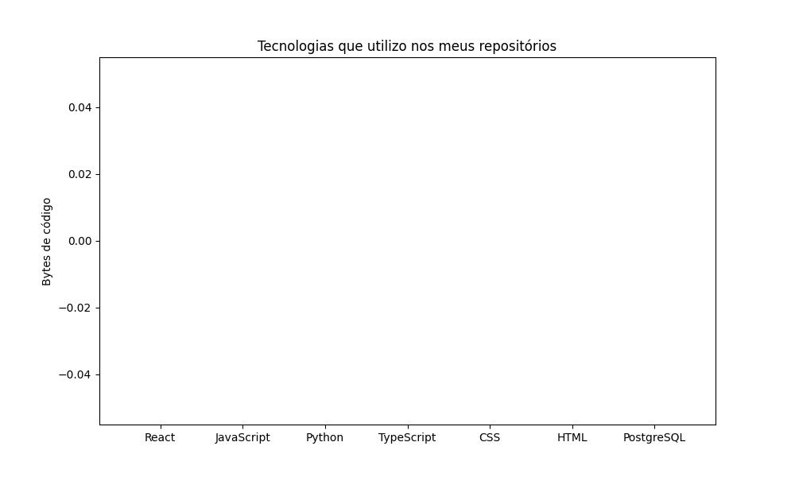

<h1 align="center">Bem vindo ao meu portifólio📚💻⚙️</h1>

###

<h3>Social:</h3>

  
  
  
  

###

<h3>Meus projetos</h3>

🔥 [Desafio DIO Open Source](https://github.com/MathiasFilypeDev/desafio-poo-dio-MathiasFilype)  
📌 [Artigo - O poder da comunicação: dicas que mudarão sua forma de se expressar](https://web.dio.me/articles/o-poder-da-comunicacao-dicas-que-mudarao-sua-forma-de-se-expressar-ef4558c69401?back=/articles)  
🥇⚖️[Artigo - A importância de um bom README em seus projetos](https://web.dio.me/articles/a-importancia-de-um-bom-readme-em-seus-projetos-09b347cf1fe8?back=/articles)

###
<h3>Linguagens e ferramentas:</h3>

  
  
  
  
  
  
  
  
  

###

<h3>Ranking de linguagens📊</h3>

###

<h3>Gráficos de desempenho:</h3>

    
  

